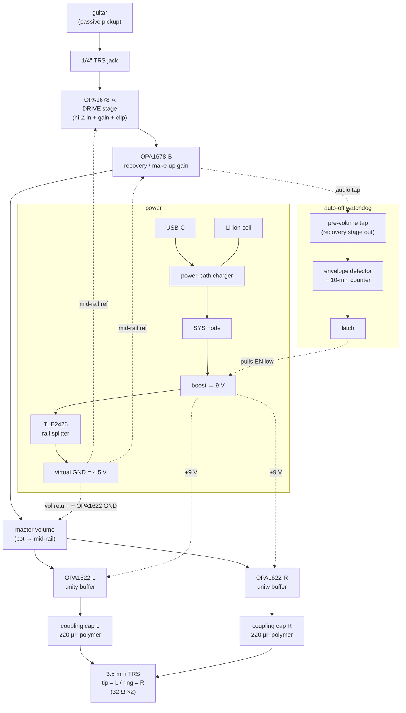
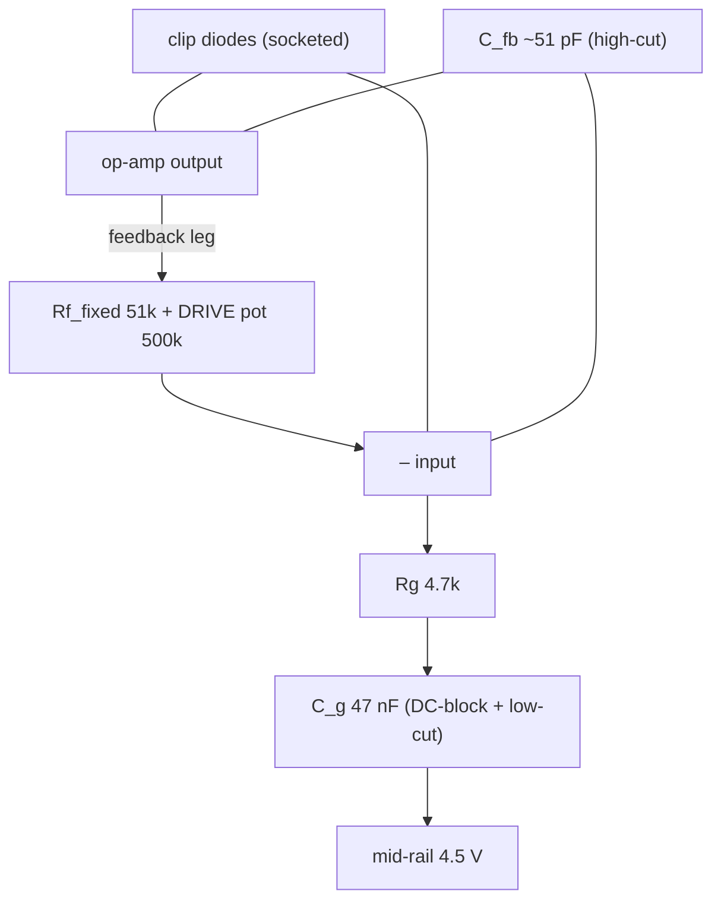
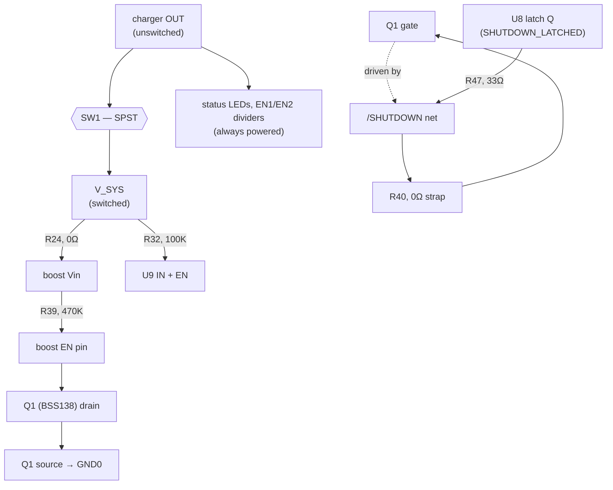

---
# Guitar Headphone Amp — Theory of Operation & Tuning Guide

> [!abstract] What this document is A working explanation of _why_ each part of the amp is shaped the way it is, and _which knobs (literal and component) change what_. It is meant to be read alongside the schematic, so that tuning rev A is informed guessing rather than blind swapping. Values given are **starting points** anchored to the Tube-Screamer (TS) gain-stage lineage — the most-measured drive circuit in guitar electronics — chosen so you tune _from_ a known-good baseline.

---

## 1. System overview

The signal path is deliberately split by **impedance**: a FET-input stage where the source impedance is high (the guitar), and a bipolar-input driver where it is low (the headphones). Everything runs off a single boosted 9 V rail with a synthesized mid-rail so the op-amps see a symmetric ±4.5 V about the audio "ground."




> The signal is **mono** through the drive and volume stages, then **fans out to L/R stereo** at the OPA1622 buffers — one per earpiece, each into its own coupling cap and the tip/ring of the TRS jack. A separate always-watching **watchdog** (§6) taps the signal pre-volume and can shut the boost off after ~10 minutes of silence — full detail in its own section, since it's a large enough subsystem to warrant one.

The three most important architectural decisions and their reasons:

- **Boost to a regulated 9 V (no LDO).** A single Li-ion cell sags from 4.2 V to 3.0 V, which is _below_ the OPA1622's 4 V floor for most of its life. Regulating _up_ keeps every stage in-spec regardless of charge state and gives constant tone (the clip threshold no longer drifts as the battery drains). We picked **9 V specifically for input headroom**: on a 6 V rail the OPA1678's input common-mode window reaches only ~1 V above mid-rail, so a hard humbucker transient can graze the top of it; 9 V opens that to ~2.5 V, clearing the hottest pickups (see §2.8). Both op-amps run to 36 V, so the higher rail changes **no parts**, and it still leaves the boost a clean step-up ratio from any source.
- **Virtual ground instead of a true negative rail.** We only need a _reference_ at mid-supply, not a second regulated rail. The TLE2426 synthesizes 4.5 V with milliohm output impedance. Signals are AC-coupled around it, so the headphone return current goes to battery-negative, **not** through the mid-rail — keeping the reference quiet.
- **FET input, bipolar output.** A passive pickup must see ≥ 1 MΩ or it loses treble; a bipolar input's ~µA bias current across 1 MΩ would create ~volts of offset. So the front end is FET (pA bias). The headphone load needs current, which bipolar output stages deliver with low distortion — hence the OPA1622 at the low-impedance end.

> [!info] Companion docs Component-level wiring lives in the **[[Connectivity-Netlist]]** companion (per-stage netlist tables). The figure above is `system-block-diagram.svg`.

---

## 2. The input & drive stage — the heart of the tone

This one op-amp does three jobs at once: **present a high-impedance input**, **amplify**, and **clip**. Understanding how those coexist is most of understanding the amp.

### 2.1 Why non-inverting = high-Z for free

In a non-inverting amp the signal enters the **+ input**, which only ever sees the bias resistor to ground. The gain-setting network hangs off the **– input**, on the op-amp's side of the loop. So the pickup never "sees" the gain resistors — input impedance and gain are set at two different nodes and don't trade against each other. That is why we don't need a separate unity-gain buffer: a non-inverting gain stage _is already_ a buffer that happens to also amplify.

### 2.2 The feedback network is five parts, not one



|Part|Value (start)|Job|
|---|---|---|
|`R_bias` (R13)|1 MΩ to mid-rail|high-Z input + DC bias to 4.5 V|
|`C_in` (C2, series at input)|0.1 µF PEN film|blocks the pickup's DC path so it can't fight the 4.5 V bias; ~1.6 Hz corner|
|`R_series` (R10) + `C_rf` (C3)|1 kΩ + 470 pF NP0|defined ~340 kHz RF/hum roll-off + input protection|
|`Rg` (R12)|4.7 kΩ|lower leg of the gain divider (sets the floor)|
|`C_g` (C5, series with Rg)|47 nF|**DC-block** (gain = 1 at DC) + **low-cut** ≈ 720 Hz|
|`Rf_fixed` (R11)|51 kΩ|bounds the top; sets minimum (cleanest) gain|
|`DRIVE pot` (via J4)|500 kΩ linear|the amount-of-dirt control|
|`C_fb` (C4)|51 pF NP0|**high-cut**; tames fizz/RF, aids stability|
|clip diodes (socket J7)|2× 1N4148|soft-clip across the feedback leg|

### 2.3 The gain equation

Above the capacitor corners (i.e. in the audio midband), the stage is a plain non-inverting amp:

$$ A_v ;=; 1 + \frac{R_{f,\text{fixed}} + R_{\text{pot}}}{R_g} $$

With the starting values:

$$ A_{v,\text{min}} = 1 + \frac{51\text{k}}{4.7\text{k}} \approx 12;(21,\text{dB}), \qquad A_{v,\text{max}} = 1 + \frac{551\text{k}}{4.7\text{k}} \approx 118;(41,\text{dB}) $$

…about a **20 dB drive range**. Turning the pot doesn't change the clip _ceiling_ — it changes how hard the signal slams into the diodes, i.e. how much of the waveform gets clipped and how early.

### 2.4 Why there's a capacitor in series with Rg (the load-bearing trick)

`C_g` does two things at once:

1. **DC stability.** At DC the cap is open, so `Zg → ∞` and the gain collapses to **1**. That means the amplified input offset can't slam the output to a rail — the stage passes the 4.5 V bias straight through at unity and only develops gain for AC. Omit this cap and the stage rails on its own offset at high drive.
2. **Bass tightening.** The corner $f = \tfrac{1}{2\pi R_g C_g} = \tfrac{1}{2\pi (4.7\text{k})(47\text{n})} \approx 720\text{ Hz}$ means low frequencies see _less_ gain than mids. Thinning the bass **before** the clipper is what keeps distorted chords tight instead of turning to mush (low notes otherwise dominate the clipping and intermodulate).

### 2.5 Why the treble rolls off _more_ as you crank

`C_fb` across the feedback creates a high-cut at $f = \tfrac{1}{2\pi R_f C_{fb}}$. But `R_f` grows with the drive pot, so the corner **moves down** as you add gain:

- Drive min: $R_f = 51\text{k} \Rightarrow \approx 61\text{ kHz}$ (bright)
- Drive max: $R_f = 551\text{k} \Rightarrow \approx 5.7\text{ kHz}$ (darker)

This is why a TS-style circuit smooths and thickens as you crank it — it's not a side effect, it's the mechanism. Putting §2.4 and §2.5 together gives the stage's actual frequency response:


Read this as: a **band** whose bottom is fixed at ~720 Hz and whose top slides _down_ as you add drive. The midband gain rises (12× → 118×) and the treble corner falls (61 kHz → 5.7 kHz) simultaneously.

### 2.6 How the diodes clip

Two anti-parallel diodes sit across the feedback leg. While the output stays below a diode's forward voltage `Vf`, the diodes are open and the stage has its full gain. Once the output tries to exceed ±`Vf`, a diode conducts, shunting feedback current and dropping the incremental gain toward ~1 — so the output _soft-limits_ around ±`Vf`. Because the knee is set by the diode's exponential I–V curve, the corners are rounded, not square: this is **soft clipping**.


The diode's `Vf` sets the clip threshold, which sets both **loudness** and **feel**:

- **Germanium (~0.3 V):** clips earliest → quiet, spongy, "compressed" — least headroom.
- **Silicon 1N4148 (~0.6 V):** the classic TS voice — moderate, singing.
- **LED (~1.8 V):** clips latest → loud, open, more dynamic, closer to the rails.

> [!note] Idealization The curves above are drawn as `tanh()` for clarity. Real diodes have a slightly softer knee and keep creeping upward past `Vf` (they never perfectly clamp), which is part of why real clipping sounds "alive." Trust the _ordering and spacing_ of the thresholds, not the exact flat tops.

### 2.7 Symmetric vs asymmetric — where the harmonics come from

A **symmetric** clip (equal top and bottom) produces mostly **odd** harmonics — the fizzy, "solid-state" character. Making the clip **asymmetric** (e.g. 1 diode one way, 2 the other, so the two sides clip at different thresholds) adds **even** harmonics, which the ear reads as warmer and more "tube-like."


Notice the asymmetric trace flattens one polarity more than the other — that top/bottom inequality _is_ the even-harmonic content. This is the single cheapest tone change you can make, and it's why the diodes are socketed.

> [!tip] How the socket actually works (rev A) The feedback clipper is a **Mill-Max socket** (`J7`, two rows of four) with a **0 Ω link (`JP1`/`JP2`) populated on each row by default**. Default = one silicon diode per direction → **symmetric**. To go **asymmetric**, pull the 0 Ω on one side and plug a _second_ diode into that row's spare holes (two in series → higher Vf that direction). Diode _type_ swaps (Si / Ge / Schottky / LED) are just pull-and-replace. The silkscreen marks anode direction per row — mind orientation when inserting an anti-parallel pair.

### 2.8 The optional input soft-limiter (Ihsan's idea)

This is a _different_ clipper doing the _opposite_ job at the _opposite_ end of the stage, and it's worth understanding as its own thing.

The feedback diodes (§2.6) clip the **amplified** signal, _after_ gain — that's the distortion voicing. The **input soft-limiter** is an optional second anti-parallel pair at the very **input**, from `FIRST_STAGE_IN` to mid-rail, _before_ any gain. It doesn't shape distortion; it **tames the raw guitar transient** — the fast, multi-volt spike a hard-struck humbucker throws before the note settles.

**Why it exists (and why 9 V made it optional rather than mandatory).** The drive op-amp's + input has a finite common-mode window — on 9 V, about 4.5 V ± 2.5 V. A very hot pickup, hit hard, can briefly push the + input past the top of that window. The OPA1678 has no phase reversal, so it just soft-limits gracefully — but you'd rather not lean on that. Clamping the raw input to `VMID ± Vf` keeps the signal inside the CM window _by construction_, and as a bonus adds a gentle **compression** on the loudest peaks — the "smooths the tops even at low drive" behaviour Ihsan described. Because the clamp sits _before_ gain, it works at any drive setting, including diodes-out clean-boost mode.

**Vf sets how much it does:**

- **Higher Vf (LED ~1.8 V, or two Si in series ~1.2 V)** — catches only the biggest transients; sits below the ~2.5 V CM ceiling but above normal playing, so it protects the input and lightly compresses without audibly squashing. The "insurance + subtle tamer" setting, and where I'd start.
- **Lower Vf (single Si ~0.6 V, Ge ~0.3 V)** — clamps early and hard; now it's a deliberate **input compressor/limiter** that squashes dynamics before the dirt. A real effect, but a strong one.

**Wiring:** anti-parallel pair from `FIRST_STAGE_IN` (the node _after_ `C_in`, i.e. the AC signal riding on mid-rail) to `VMID`. **Confirmed intentional skip for rev A** — not in the netlist, no footprint provisioned. The 9 V headroom argument above was judged sufficient on its own; revisit for rev B if bench testing ever suggests otherwise.

> [!note] Why it's at the input, not the output Ihsan's first instinct was to use the _final_ drive stage's diodes as the transient tamer. But those feedback diodes clamp relative to the _post-gain_ signal and don't care about the rail — so rail voltage can't give them "room" to gently limit an _input_ transient. The raw transient only exists _at the input_, so that's where a soft-limiter has to live to do the job he described. Same idea, correct location.

---

## 3. The drive pot taper (an honest correction)

Earlier in the design chat I claimed a **log** taper "spreads the dirt evenly." That's the right rule for a _volume_ control, but for a _drive_ control it's not quite right, and the chart shows why:


Because gain in dB is already compressive in pot resistance:

- **Linear (B) taper:** the dB change is **front-loaded** — most of the tonal action happens in the first half of rotation, then it flattens. (This is what a real Tube Screamer uses.)
- **Audio/log (A) taper:** the dB change is **back-loaded** — the knob stays near minimum for most of its travel, then the dirt arrives in a rush near the top.
- **Even-in-dB** would actually require an **anti-log (C) taper**, which is exotic and rarely stocked.

Neither standard taper is "correct" — they just put the usable range in different places. **Recommendation:** socket the pot and try both a linear and an audio taper; pick by feel. If you want the vintage TS response, linear is authentic.

---

## 4. Recovery & make-up-gain stage (OPA1678-B)

After the clipper the signal is **small and compressed** — roughly 0.4 V RMS and nearly independent of the drive setting (drive changes _how much_ clipping, not the ceiling). This stage restores level so the output buffers have a healthy signal to work with. It's the **second half of the OPA1678 dual**.

### 4.1 Inverting, fixed ~3× gain

Channel A had to be non-inverting for its high-Z input. Channel B is fed by the drive stage's **low-impedance output**, so it doesn't need high-Z — which frees the choice, and we take **inverting** for flexibility (an inverting summing node is the natural place to add a clean/dirty blend or tone shaping in rev B) and simplicity. The gain is **fixed**: the drive knob already sets "how much dirt," so this is set-and-forget make-up gain, not a second control.

$$A_v = -\frac{R_f}{R_{in}} = -\frac{100\text{k}}{33\text{k}} \approx -3.0$$

The polarity inversion is inaudible. Keep `R_in` in the tens of kΩ so it's an easy load on the drive stage while keeping resistor noise sane.

### 4.2 Two things inverting _forces_ you to add

Inverting flips where the reference and the DC block live compared to channel A, and both are easy to forget:

1. **Mid-rail goes on the + input.** In an inverting stage the **+ input is the DC reference** — tie it to virtual ground (4.5 V) through `R_ref` (R16, **33 kΩ**). Feedback then pins the – (summing) node to 4.5 V as well, setting the output's DC operating point at mid-rail. (With the FET-input OPA1678, input-bias-current matching barely matters, so `R_ref`'s exact value isn't critical — R16 happens to match R_in's value, which isn't load-bearing, just convenient.)
2. **A DC block in series with `R_in`.** The drive stage output sits at 4.5 V DC and so does the summing node — but clipper and offset asymmetries mean it isn't _exactly_ 4.5 V, and any mismatch × 3 would push this stage's output off-center and eat headroom. A cap in series with `R_in` (R15) blocks that hand-off error and sets the low corner: `C_inB` (C6) 0.1 µF with `R_in` 33 kΩ → **~48 Hz** (passes all guitar bass).

A small `C_fbB` (**51 pF**, not the originally-planned 100pF, across `R_f`; `C7`, **populated in rev A**) sits directly across R14, giving this stage its own high-cut at $f = \tfrac{1}{2\pi R_{14} C_7} \approx 31.2\text{ kHz}$.

> [!note] Not pure insurance at every drive setting Unlike channel A's `C_fb`, this corner is **fixed** (R14 doesn't move), while the drive stage's own high-cut _sweeps_ from 61.2 kHz (min drive) down to 5.66 kHz (max drive). At high drive, the drive stage's corner is already lower than 31.2 kHz, so C7 is genuinely just stability insurance. At low-to-moderate drive, the drive stage's corner sits _above_ 31.2 kHz, and C7/R14 becomes the more restrictive filter in the chain — not decoration at that setting. Still well above anything a guitar pickup meaningfully produces, so not expected to be audible, but worth knowing it's not uniformly inert the way it was originally framed. If you ever want it to be pure insurance at every drive setting, dropping C7 to ~15–20 pF pushes its corner to ~80–106 kHz, safely above the drive stage's entire sweep.

### 4.3 Optional hard clip (DNP)

Two anti-parallel diodes provisioned **DNP** from this stage's **output to mid-rail** give a _hard_ clipper — clamping to ±Vf regardless of the op-amp, a harsher flavor stacked on channel A's soft clip. Place them at the **output (a fixed-level node, before the master volume)** so the clip threshold stays constant; after the volume pot it would move with the knob. Probably never populated — cheap experiment insurance, in keeping with socketing the tone-critical parts.

> The master volume pot and the hand-off to the L/R output buffers are covered in **§5.3** — a single mono audio-taper pot after this stage, feeding both buffers, returned to mid-rail so the wiper self-biases them.

---

## 5. Output stage — dual OPA1622 as L/R buffers

The small-signal op-amps upstream can't source the tens of milliamps a 32 Ω headphone wants; the OPA1622 is a bipolar-input part built exactly for that (high output current, very low distortion into 32 Ω, happy on the 9 V rail). Its bipolar input would be wrong at the 1 MΩ front end (bias-current offset) but is ideal here, looking back into the low output impedance of the volume stage.

### 5.1 Mono in, stereo out

The guitar is mono, but headphones have two drivers and the 3.5 mm **TRS** jack carries tip (L) and ring (R) over a common sleeve. So the OPA1622 dual becomes **two channels fed the same post-volume signal** — one drives tip, one drives ring, each through its own coupling cap into its own 32 Ω earpiece. Two buffers each into 32 Ω also beats one buffer into a paralleled 16 Ω: half the per-channel current and half the coupling-cap value for the same low-end corner. The path is therefore mono all the way to the OPA1622, then fans out to L/R.

### 5.2 Unity-gain followers (why not gain here)

Each channel is a **unity-gain follower**, because its job is _current_, not voltage — the gain already happened upstream. Unity also avoids a single-supply trap: a non-inverting _gain_ stage would multiply the 4.5 V mid-rail bias and slam a rail unless you AC-couple the feedback; a follower's output DC simply equals its input DC (4.5 V), idling at mid-rail with no extra parts. The OPA1622 is unity-gain stable, so this is clean.

> [!note] The clean ceiling is the input range, not the output swing In a follower the + input tracks the output, and the OPA1622's common-mode range is (V–)+1.5 to (V+)–1, i.e. **1.5 V to 8 V** on this rail. So the clean limit is 4.5 V ± 3 V ≈ **2.1 V RMS** (~140 mW into 32 Ω) — far more than headphones need, and set by the _input_ CM range, not the rail-to-rail output. If you ever wanted more, a small AC-coupled gain relieves it (the + input then swings only a fraction of the output).

### 5.3 Master volume placement

A single mono **audio-taper** pot sits _after_ OPA1678-B and _before_ the two buffers, its wiper feeding both. Tie the pot's low end to the **mid-rail (4.5 V)**, not 0 V: then both ends of the track sit at 4.5 V DC, the wiper is always at 4.5 V DC, only the AC is attenuated — so the buffer inputs stay correctly biased with **no extra coupling cap**. (Return it to 0 V instead and the wiper DC would droop with rotation, forcing another blocking cap.)

### 5.4 Output coupling caps — polymer, not bipolar

Corner into 32 Ω is $f = \tfrac{1}{2\pi RC}$: **220 µF → ~23 Hz**, flat well below the low-E (~82 Hz). We use the **Würth 875105244013** — a 220 µF / 10 V aluminum-**polymer** SMD can, 30 mΩ ESR, 6.3 × 5.8 mm.

> [!warning] Correction from an earlier instinct A _bipolar_ electrolytic is the generic-audio reflex for a coupling cap, but it's wrong for **this** board on two counts: bipolar electrolytics are almost all through-hole radial cans (fighting an SMT, plug-in build), and the reverse-bias condition that motivates them barely occurs here. The cap idles at **+4.5 V forward bias**, and at audio frequencies its impedance is tiny next to the 32 Ω load, so almost all the AC drops across the _load_, not the cap — it just sits near +4.5 V with small ripple. Reverse-biasing it would need volts of sub-bass AC below the ~23 Hz corner, which a guitar simply doesn't produce. So a **polarized** polymer is both appropriate and better (lower ESR, no dry-out, SMD, small). 30 mΩ in series with 32 Ω is ~0.1% — inaudible; skip the film bypass.

Orient **+ toward the amp** (the +3 V node).

> [!warning] Bleed resistor — not yet in the rev-A netlist The plan was a **bleed resistor (~100 kΩ–1 MΩ)** from each coupling cap's load side to 0 V, so it pre-charges/discharges gently — half the turn-on-thump fix. Checked against the current schematic: `C18`/`C19`'s load-side pins go straight to the jack (`J8` tip/ring) with nothing else on that net. This didn't make it in — worth adding before layout if the turn-on thump is worth chasing, since the EN soft-start (§5.6) only handles the other half of that fix.

### 5.5 The GND-pin decision (and why it drives the EN scheme)

Tie the OPA1622 **GND pin to the virtual ground (mid-rail), not 0 V.** That pin references the internal compensation cap that gives the part its high PSRR, and it wants a low-impedance, low-noise reference — which the 7.5 mΩ mid-rail is, precisely because we kept the headphone return on 0 V. Referencing GND to the noisy 0 V/return rail instead would partly waste the PSRR you're paying for.

The consequence: EN's thresholds (≤ 0.78 V shutdown, ≥ 0.82 V enable) are referenced to that GND pin, so with GND at 4.5 V, **enable now means EN ≥ ~5.32 V**.

### 5.6 EN soft-start (default-populated)

`R_en` from **V+ (9 V)** to EN, `C_en` from **EN to 0 V**. At power-on EN starts at 0 V and rises as $V_{EN}(t)=9,(1-e^{-t/\tau})$, $\tau=R_{en}C_{en}$; it crosses the 5.32 V enable point at

$$t_{enable} = \tau,\ln!\left(\tfrac{9}{9-5.32}\right) \approx 0.89,\tau$$

— almost exactly one time constant. **R_en (R48) = 100 kΩ, C_en (C32) = 2.2 µF → ~200 ms delay** (τ ≈ 220 ms), comfortably after the rails and big caps settle, imperceptible as an annoyance — matches the schematic exactly. Keep R_en stiff (~100 kΩ, not 1 MΩ): the EN bias current (~3 µA) across it is only ~0.3 V of droop, so EN parks near 8.7 V — solidly enabled.

> [!warning] Schottky across R_en — also not yet in the rev-A netlist The plan was a **Schottky across R_en** (anode at EN) to do nothing on power-up but, on power-_down_, dump C_en into the collapsing rail and yank EN into shutdown fast — muting the amp _before_ the rails sag into pop territory. Not present on the current `Current Buffer` sheet — R48/C32 exist, the diode doesn't. Same status as the bleed resistor above: a real, still-open piece of the turn-on/off pop mitigation, not yet committed to silicon.

### 5.7 Housekeeping (from the datasheet)

- **Thermal pad → V– (0 V)** with a copper pour + vias (heat path _and_ internal reference).
- **0.1 µF at each supply pin** to 0 V, plus a bulk cap.
- Worst-case continuous dissipation rises modestly on the 9 V rail but is still only a few hundred mW per channel into 32 Ω — you'll never sustain that into headphones, so the VSON pad copes easily.
- **Provision, don't commit, for cable stability:** a series-R (start 0 Ω) + optional Zobel (R–C to 0 V) footprint per output, decided on the bench. Keep any series R tiny — even 10 Ω into 32 Ω hurts damping/level, which matters for low-impedance IEMs. **In the netlist:** `R49`/`R52` are the series-R (0 Ω, both channels), `C34`+`R50` and `C35`+`R51` are the Zobel R-C-to-ground pairs. Ceramic is the right call for the Zobel cap specifically — its job is presenting a defined low impedance only _above_ the audio band, so it carries essentially no signal current in-band, which sidesteps both reasons ceramics get avoided elsewhere on this board (DC-bias capacitance sag, microphonics). Currently `R50`/`R51` are also populated at 0 Ω (DNP), meaning the Zobel caps aren't yet a genuinely open/undecided provision — they're a hard-wired 0.1 µF straight to each op-amp's output. Worth switching those two specifically to DNP rather than 0 Ω until you're actually tuning them in on the bench.

> [!warning] V+9A rail split — part placed, not yet actually wired in The plan was to keep OPA1622 on the main V+9 and put OPA1678 behind its own bead-filtered V+9A, so headphone transients can't sag back into the front end. `FB3` (TDK MDF2016BSS600CTD25) is now in the design for this — but checked against the netlist, both of its pins currently land on the same `/V+` net. It's placed, not yet doing anything; U2 still shares the raw, unfiltered boost output with U3. The fix is a net split — rename the node between FB3's downstream pin and U2's V+ pin to its own net (e.g. `V+9A`), rather than leaving both ends of the bead shorted together.

---

## 6. Auto-off watchdog

Idle-timeout circuit: envelope detector → CD74HC4060 counter → NOR latch → boost EN override. Shuts the amp off after ~10 minutes of no playing, without a microcontroller. Idea by Claude, refined and implemented over several sessions; the values and topology below are verified against the actual rev-A netlist, not the original starting-point guesses.

**Logic chip allocation:**

- **U7 (74HC14, hex Schmitt-trigger inverter)** — the two jobs that square up a slow analog ramp and need hysteresis: envelope threshold detector and POR pulse shaper.
- **U8 (74HC02, quad 2-input NOR)** — all pure digital logic, no hysteresis needed: the SR latch (cross-coupled), and the reset-OR combiner (a NOR followed by a NOR-with-tied-inputs acting as an inverter), giving `det_out OR por_pulse` for the 4060's reset pin. All 4 gates used.
- **U6 (CD74HC4060)** — the oscillator + 14-stage counter itself.
- **U9 (TLV7A0325PDBVR)** — the always-on nanopower LDO that gives the watchdog logic a stable `V_LOGIC` (~2.5 V) independent of SYS's 3.0–5.2 V swing, so the Schmitt threshold and oscillator frequency don't drift with charge state or USB-plugged status.

### 6.1 Oscillator

Pierce/star topology (all three components meet at one common, ungrounded node) — see §6.4 for why this matters, it's not a simple RC-to-ground.

```
f_osc = 1 / (2.2 × R37 × C23)
=> f_osc = 1 / (2.2 × 100K × 0.68µF) = 6.68 Hz
```

R36 (220 kΩ) is the isolation/protection resistor on the CLK pin, sized ≈2×R37 per the datasheet's stability condition — not part of the frequency formula itself.

Counter output Qn first goes high at $t = 2^{(n-1)}/f_{osc}$ (half of Qn's own period, since it starts low from reset). **Q13** gives:

```
t = 2^12 / 6.68 Hz = 4096 / 6.68 ≈ 613 s ≈ 10.2 minutes
```

This is an RC oscillator, not a crystal — expect the real board to land somewhere in a band around 10.2 minutes depending on R/C tolerance, not hit it precisely. Nothing about the circuit needs better than that.

### 6.2 Envelope detector

Taps the recovery stage's output (§4) — **pre-volume**, so a quiet volume setting can't fool the timer into thinking no one's playing.

|Ref|Value|Job|
|---|---|---|
|`C20`|1 µF X7R|AC-coupling into the detector|
|`D4`|1N4148W|rectifies the coupled signal|
|`R29`|470 kΩ|bias/bleed on the AC-coupled node, to GND|
|`C21`|0.22 µF|envelope hold cap|
|`R30`|470 kΩ|top half of the threshold divider|
|`R31`|470 kΩ|bottom half of the threshold divider, to GND|

R30/R31 are also the hold cap's discharge path — splitting the single "bleed resistor" into two lets the tap point between them set the detection threshold for free, without adding a separate divider that would also (incorrectly) change the envelope decay time constant. U7's Schmitt gate reads the tap point; its output is `AUDIO_DETECT`.

### 6.3 Power-on reset

```
R32 (100 kΩ) + C22 (4.7 µF) → τ ≈ 470 ms
```

Charges from `V_SYS` (switched, 3.0–5.2 V) toward whatever it asymptotes to, read by a Schmitt gate powered from the _separate_ `V_LOGIC` rail. Because the input can ride above V_LOGIC, this only works safely because R32 current-limits the gate's input clamp diodes to a harmless level (tens of µA, versus a ±20 mA rating) — the same principle covers the envelope detector's divider. `U7`'s POR shaper output (`POR_OUT`) feeds both the latch's reset and the reset-OR combiner.

### 6.4 Why the oscillator isn't a simple RC-to-ground

`R37` (Rt), `C23` (Ct), and `R36` (the CLK isolation resistor) all meet at one shared node that is **not** grounded — this is a Pierce oscillator, the same family used when this pin set is driven by a crystal instead. Getting this wrong (grounding Ct directly) is an easy mistake to make from a first read of generic RC-oscillator app notes; worth remembering if this stage ever gets redesigned.

### 6.5 Switch topology and the EN override



Switch open: `V_SYS` disappears, which kills both `R24`→boost Vin (so `R39`'s EN pull-up has nothing to pull from) and `R32`→`U9`'s input (LDO off, whole watchdog dark). The charger's status LEDs and EN1/EN2 dividers stay alive regardless, since they're on the unswitched side — charge/PGOOD indication works even with the amp switched off.

Switch closed: `V_SYS` powers the LDO fresh (POR clears the latch and counter) and pulls EN high via `R39`, assuming the latch hasn't fired.

> [!warning] EN pulldown (R_pd) — not currently in the netlist The original plan included a defined pulldown from EN to GND0 (~1 MΩ) so EN has a deterministic rest state rather than floating when neither the switch's pull-up nor Q1 is actively driving it. Checked against the current schematic: it isn't there. Worth adding — a floating enable pin on a power IC is the kind of thing that's fine on the bench and unreliable in the field.

**Disabling the watchdog entirely** (bench/field escape hatch, no board respin): leave `R47` unpopulated. It's the single component bridging the latch's internal output to the global `/SHUTDOWN` net that reaches Q1 — depopulating it lets the rest of the watchdog logic run and compute harmlessly while physically cutting its only path to the boost's EN pin.

---

## 7. Tuning guide

Everything structural (topology, rail, op-amp choices) is fixed. The **flavor** lives in a handful of socketed/swappable parts. Tune in this order — biggest perceptual effect first.

### 7.1 What each handle does

|Handle|Turn it ___|Effect|
|---|---|---|
|**Diode type** (Vf)|lower Vf (Ge)|earlier clip, quieter, spongier, less headroom|
||higher Vf (LED)|later clip, louder, more open/dynamic|
|**Diode symmetry**|asymmetric (1 vs 2)|adds even harmonics → warmer, "tube-ish"|
|**`C_g`** (Rg series cap)|bigger|more bass into clipper → looser, fuzzier, thicker|
||smaller|tighter, more mid-focused, "cuts through"|
|**`C_fb`** (feedback cap)|bigger|darker, especially at high drive; kills fizz|
||smaller|brighter/edgier at high drive|
|**`Rf_fixed`**|bigger|raises _minimum_ gain (min-drive is dirtier)|
|**Drive pot taper**|linear vs audio|moves where the usable range sits in rotation|

### 7.2 Suggested order of attack

1. **Get it working clean first.** Populate with **no diodes** (open sockets) → verify the stage is a clean amp with the expected gain and no rail-slamming or oscillation. This proves the bias, the `C_g` DC-block, and stability before you add nonlinearity.
2. **Add symmetric silicon (2× 1N4148).** This is the reference voice. Confirm soft clipping on a scope and by ear.
3. **Swap diode types** (Ge, LED, mixed) and **try asymmetric** — this is the biggest tonal fork.
4. **Adjust `C_g`** to set bass-into-clipper (start 47 nF; try 22 nF for tighter, 100 nF for looser).
5. **Adjust `C_fb`** only if the top end feels wrong at high drive (start 51 pF).
6. **Decide the pot taper** last, once you know where your favorite drive settings land.

### 7.3 Symptom → fix

|Symptom|Likely cause|Try|
|---|---|---|
|Output stuck at a rail, no signal|`C_g` missing / wrong; amplified offset|confirm `C_g` in place; check + input sits at 4.5 V|
|Farts out / flabby on low notes|too much bass into clipper|**smaller `C_g`** (e.g. 22 nF)|
|Thin / buzzy, no body|too little bass, or clip too hard/bright|bigger `C_g`; higher-Vf diodes; bigger `C_fb`|
|Harsh / fizzy top|ultrasonic content amplified|**bigger `C_fb`**; verify RF input filter|
|Not enough grit at full drive|gain range too low|larger drive pot or smaller `Rg`|
|All the action crammed at "10"|taper mismatch|try the other taper (§3)|
|Motorboating / oscillation|layout / feedback / supply bypass|add/verify `C_fb`; tighten supply decoupling; check inductor placement|

---

## 8. Starting values (rev A baseline)

```
Rail:      9 V boost · virtual ground 4.5 V (TLE2426) · both op-amps on V+/VMID
Input:     C_in(C2) 0.1µF PEN film · R_bias(R13) 1MΩ · RF: R_ser(R10) 1kΩ + C_rf(C3) 470pF NP0
Gain leg:  Rg(R12) 4.7kΩ · C_g(C5) 47nF
Feedback:  Rf_fixed(R11) 51kΩ · DRIVE pot 500kΩ LINEAR (Same Sky, via J4) · C_fb(C4) 51pF NP0
Clipper:   socket J7 (Mill-Max, 2 rows×4) · 2×1N4148 default (SYMMETRIC)
           JP1/JP2 0Ω shorts populated · pull one + add diode = ASYMMETRIC
Recovery:  R_in(R15) 33kΩ · Rf_B(R14) 100kΩ (gain ~3×, inverting) · C_inB(C6) 0.1µF (~48Hz)
           R_ref(R16) 33kΩ→mid-rail · C_fbB(C7) 51pF, ~31.2kHz (populated) · hard-clip D2/D3→mid-rail (DNP)
Volume:    audio pot via J6 · low end → mid-rail (wiper self-biases)
Input lim: DNP/socket provision, FIRST_STAGE_IN → mid-rail (see §2.8) — confirmed intentional skip for rev A
Output:    Zobel/series-R provision at R49/R52 + C34+R50 / C35+R51 (§5.7) · bleed R and Schottky-across-R_en still open (§5.4, §5.6)
Watchdog:  CD74HC4060(U6) + 74HC14(U7) + 74HC02(U8) + TLV7A0325PDBVR(U9) LDO — ~10.2min timeout via Q13, R_pd still open (§6)
Result:    gain 12×–118× (21–41 dB) · low-cut ~720Hz
           high-cut 61kHz→5.7kHz across drive · soft clip ±~0.6V
```

> [!tip] Post-clip level After silicon clipping the signal is small and compressed (~0.4 V RMS) and roughly independent of drive. The **recovery stage (OPA1678-B) therefore wants make-up gain, not attenuation** — that's the inverting ~3× stage in **§4**, feeding the master volume and L/R buffers.

---

## 9. Further reading

- **ElectroSmash — "Tube Screamer Analysis"** — component-by-component teardown of exactly this gain/clip topology; the definitive reference for the numbers here.
- **ElectroSmash — "LM386 Analysis"** and the _runoffgroove_ "Ruby" — for the lo-fi power-amp lineage if you ever want a discrete/IC output alternative.
- **TI OPA1622 datasheet (SBOS727)** §8.2 & Fig. 48 — headphone-driver application + the EN anti-thump divider.
- **TI OPA1678/OPA1656 datasheets** — the "no phase reversal" behavior and (in the OPA1656 doc) an actual guitar-input reference schematic.
- **TI TLE2426 datasheet (SLOS098)** — rail-splitter noise-reduction pin behavior.